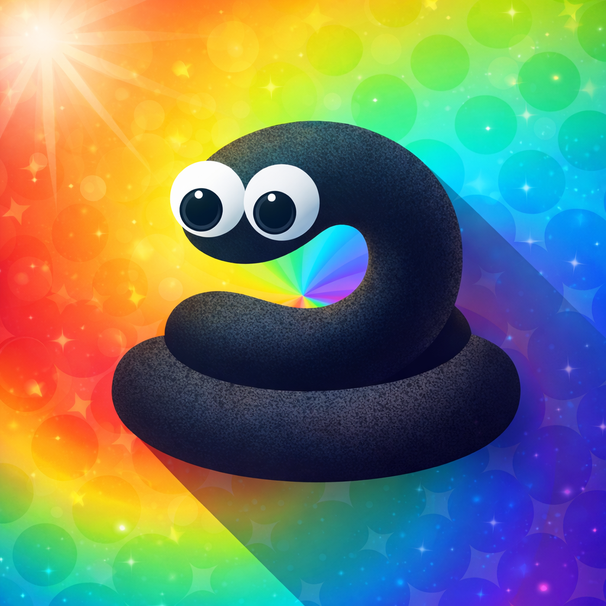

<div align="center">
  
  
  # RawSnakeIO 🐍 [ALPHA]

  
  
  
</div>

**RawSnakeIO** is an experimental, open-source server implementation for Slither-style IO games, written in C++. 

**⚠️ WARNING: HEAVY CONSTRUCTION AHEAD ⚠️**

This project is currently in a **rough Alpha state**. It works, but it has issues. It creates snakes, it handles packets, and it runs—but do not expect a production-ready server. Expect bugs, unfinished features, and unoptimized code.

## 📦 The "Third Party" Situation

You will notice a `third_party` folder included in this repository. 
**Do not delete or replace these with system libraries, unless you know what you are doing...**

I have manually modified the source code of several dependencies (like `websocketpp` or `boost` headers) to make them behave with this specific server architecture. Updating these to their official versions **will likely break the build.** Use the vendored versions provided here.

## 🎯 Current Status

*   **Protocol:** Supports versions 11-14 (Handshake `6`, `a`, `s` packets mostly working).
*   **Movement:** Snake movement and steering logic is present but twitchy.
*   **Collision:** Sector-based detection is implemented (`game/sector.cc`) but needs optimization.
*   **Bots:** Basic AI exists (`Snake::TickAI`)—they aren't smart, but they move.
*   **Stability:** It runs, but may crash on edge cases or high concurrency.

## 🛠️ Build Instructions

Since dependencies are modified and included, the build process is self-contained. You still need a C++11 compliant compiler and CMake.

### 🐧 Linux (GCC/Clang)

1.  **Install dependencies:**
    ```bash
    sudo apt-get install libboost-system-dev libboost-thread-dev libboost-program-options-dev cmake build-essential
    ```

2.  **Build:**
    ```bash
    cmake -B build -DCMAKE_BUILD_TYPE=Release
    cmake --build build
    ```

3.  **Run:**
    ```bash
    ./build/bin/slither_server --bots 50
    ```

### 🪟 Windows (MinGW-w64 via MSYS2)

1.  **Setup MSYS2** and install dependencies in the MINGW64 terminal:
    ```bash
    pacman -S mingw-w64-x86_64-toolchain mingw-w64-x86_64-cmake mingw-w64-x86_64-boost mingw-w64-x86_64-ninja
    ```

2.  **Build:**
    ```bash
    cmake -G Ninja -B build -DCMAKE_BUILD_TYPE=Release
    cmake --build build
    ```

3.  **Run:**
    ```bash
    ./build/bin/slither_server.exe --bots 50
    ```

## 🐛 Known Issues (The Short List)

*   **Naming Bug:** Player names are not pulled correctly from the initial packet (snakes often spawn nameless or with garbage data).
*   **Hitbox Misalignment:** The snake hitbox and food consumption radius are currently aligned strictly with the mouth/nose, rather than the center of the head, causing visual desyncs.
*   **Sector Leaks:** Sectors loaded into the client's viewport do not unload correctly after the player moves away, potentially causing lag or memory issues over time.
*   **Challenge Response:** Validation is currently bypassed/hardcoded.
*   **Performance:** High CPU load on `on_timer` tick when the map is populated with many entities.
*   **Memory:** Smart pointers are used, but ownership is messy in `world.cc` and needs a refactor.

## 🤝 Contributing

If you are brave enough to dive into this code:

1.  **Fixes:** If you fix a segfault or a logic error, please submit a PR!
2.  **Cleanup:** Refactoring `game.cc` or `server.cc` to be cleaner is highly appreciated.
3.  **Third Party:** If you can figure out how to untangle the modified libraries so we can use standard versions, you are a hero.

## 🏆 Credits & Acknowledgements

This project stands on the shoulders of giants and helpful community members:

*   **sitano**: Massive thanks to the original creator. This codebase is based on [slitherss](https://github.com/sitano/slitherss).
*   **Numer0us**: For providing invaluable information regarding game logic, protocols, and technical help.
*   **Challenge me** & **Alyeia**: For their support and willingness to help with the project's development.

## 📄 License

This project is open source. Do whatever you want with it, just don't blame me if your server catches fire.

---
*Based on the original Slither protocol. This project is for educational purposes only.*